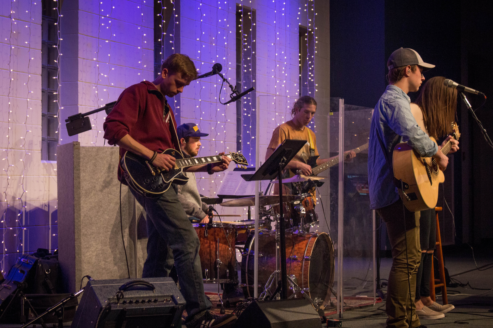

2018... 

Where to begin? How do you capture in writing a period of 365 days that contained so much? It honestly seemed silly to even try, but life experiences and lessons are worth remembering. They remind you of where you came from&mdash;what helped shape you into who you are today. 
In interest of remembering what 2018 meant for me, I decided to try to write what I can only describe as "The SparkNotes of Nathan: 2018 Edition".

Without further ado, here are some of the key points and lessons from my 2018 year.

## Graduation
2018 meant the last two quarters of my senior year at UW. While there was always a chance that I totally botched something, allowing school to own my life longer, graduation was something that was finally on the horizon. Luckily for me, but maybe not for the coffers of UW, these last two quarters were legitimately my favorite quarters of school ever. 

One could say that I saved the best for last. The classes I took, the projects I completed and the people I got to work with&mdash;all of it was top notch. I dove deep down the rabbit hole of data science and machine learning, which is by far some of the coolest material I ever covered. I stretched my thinking by contemplating the ethics of information. Most importantly, I completed my culminating [capstone project](/projects/informatics-capstone) with some of the greatest individuals I met in the Informatics Program: Andrew, Govind, and Jon. I had the great privilege of working with these guys for many projects and three versions of the cleverly named "Team Name"&mdash;never let a good joke die, right?

*Oh look at that? I guess this means I did it!*

The sad thing is it passed by so quickly. In the words of Andy Bernard, “I wish there was a way to know you're in ‘the good old days’, before you've actually left them." Sure, there was a lot of low spots mixed in those two quarters, but at this point none of that really seems to matter, leaving me with nothing but fond memories. Of course, there was a lot outside of school that made these quarters so great&mdash;more on that later&mdash;but oh boy, I'd go back and live just it again if I could.

## Goodbyes
Periods of transition, while exciting with the prospects of pastures new, bring with them a word that I dread to utter: goodbye. You can say it countless times, but the truth is saying goodbye never gets easier, but I suppose nor should it. If the goodbyes were easy, was the time spent actually worth it? No, the more profound the impact of a person, community or place was, the harder it is to say goodbye.

*Last time leaving the house as a student...for now at least*

The goodbyes of 2018 were of course to UW and everything that went along with being a student there, although they were drawn out long past graduation. During more or less the last two years of school, I worked at the UW Med Center for Department of Surgery IT. Without a job lined up for after school and grand plans of travelling and climbing, I kept hours on the calendar with Surgery IT to keep a modicum of income. Showing up to campus for work after graduation made it seem like nothing changed. I guess part of me wasn't ready to let go of UW and admit to the change, so I didn't. It's funny, I went so long saying I was ready to be done, and then once I was, being done was the last thing I wanted&mdash;to this day, part of me still wishes I was sitting on the 45, rain drizzling down the windows, on my way to campus. Eventually, I came to realize that I needed to let go and move on, so I set my last day of work. 

Needless to say, that day came all to fast. My coworkers took me out to celebrate over pizza and beers, we said our goodbyes, and then it hit me like a train. It was over. I had stepped off of campus as a student for the last time. I was done. I probably looked like a total mess walking up The Ave that day: bleary-eyed, trying my best to hold it together, but failing miserably. 

*Team Name v3 representing at graduation!*

I walked all the way home that day. My mind seems to process things the best while walking, so that's what I did. I would have preferred a hike in the woods, but you make do when you need to. What was bothering me wasn't the goodbyes to my coworkers&mdash;I'm not always the best at it, but I make it a priority to keep in touch with the people that meant something to me. No, what was bothering me was the end of a chapter of life, and all the things that went along with turning that page. 

When you spend 4 years of your life somewhere, you can't help but become a part of it. You become invested in the communities; you make friends; you find those little hole-in-the-alleyway spots where you spend way too much time and money on coffee&mdash;looking at you Cafe Allegro. While I am glad to say I still have my friends, and I can still go to my favorite alleyway coffee shop&mdash;although they probably won't remember my order anymore&mdash;I had to say goodbye to two communities that had a profound impact on my life: Informatics and The Inn.

I may not have become as invested in the Informatics community as I initially intended to, but to me it represented, and still represents, finally finding my place in all of whatever this is. After spending almost the first two years of college feeling like I didn't have a place at UW, the Informatics Community welcomed me in, gave me a voice, and made me feel like I belonged somewhere. I spent two years in the program, going to classes with the same people, completing way too many group projects, and staying up way too late too many times trying to debug deployment snags right before the due date&mdash;pro-tip: you should refresh the page if you deploy a change. 

I got used to seeing the same people in class every day, working on projects with the same people, and having the same professors. It's not like I wasn't expecting it, but when everything you're used to disappears in a day, it throws your rhythm off completely&mdash;well, at least it did for me. I think that's part of the reason I kept working at the Med Center as long as I did: to avoid too much change at the same time. Deep down, I anticipated graduation bringing about a lot of change, and subconsciously decided to ration it out instead of facing it all at once. Did it work though? Hard to say.

*Oh, how I miss this*

Half way through my freshman year, drawn by the prospect of free tacos, my cousin Wyatt and I decided to check out this college group we heard about called The Inn. Looking back, I owe so much to that fateful Tuesday night. Where Informatics made me feel welcome as a student, The Inn made me feel welcome as a person. It was my first community in Seattle, and the first time I felt that people really wanted to be my friend, as opposed to just that guy my classmates talked to. If I'm being honest, The Inn is most of the reason I even stayed at UW during those first two years of school.

As the years went by, I made amazing friends, they let me play my guitar for the band at volumes I only ever dreamt of, and as I grew in the community, I grew as a person. The Inn started the process of chipping away at the shell of a shy person I was going into college, and between it and Informatics, I started becoming more confident in who I was as an individual.

I still spend time with my friends I met through The Inn, wether it's catching up over a cup of tea, making songs that have no apparent end, sending at the local rock gym, going on random adventures, or even simply going home to the three rad dudes I live with, but to the community itself&mdash;the act of going to Larsen Hall on Tuesday nights or countless other events&mdash;I had to bid farewell. Sure, I could have kept going for a little while at least, but when you know it's time to let go of something, you kinda just have to.

These are the thoughts that ran through my mind on that walk home. Knowing it was time to say goodbye to this chapter of life didn't make it any easier, but like I said, I guess that means it all meant a whole lot to me.

## Lesson 1: Don't get too attached to your plans.
Going into my Senior year I had a plan that was foolproof. I was going to graduate, take the summer off for all the adventures ever, line up a job during August, and assume my position as a gainfully employed member of society come end of September.

*My view for 5 days as my plans went completely on hold*

Of course, best laid plans always seem to have a way of falling through, and I guess this time a literal falling wood router would have a thing or two to say about my plans.

## Injury, Surgery, and Surgery...Again

Yes, you read that right. I had two surgeries in 2018. Two times, my poor ring finger was opened up as a result of a mallet finger injury. So what's a mallet finger injury? Well, it's a separation of the extensor tendon at the tip of your finger that causes your finger to be hooked at the last knuckle. You're probably thinking, "oh I bet you injured yourself climbing?" which would be totally logical, but wrong. Try a wood router.

In December of 2017, I decided to build a desk as I was tired of using a folding plastic table. I got it to a point that was useable during Winter Break&mdash;may or may not have just been the top of the desk being supported by the folding table&mdash;but ultimately, it ended up being one of my procrastination projects during school. I'd work on it here and there, but it wasn't till summer that I got the chance to actually finish it.

I'll spare the gory details, but my Uncle Ron and I were using a wood router to finish the edges on the desk legs. The powering down router decided to fall from the workbench while I was picking up the next leg from the floor. I tried to pull back, but it took a bad bounce. We went straight to urgent care, then to Oly Ortho, and I ended up in surgery the next morning.

*That thing was in my finger for 6 weeks!*

They sewed the tendon back together, put a pin in my finger to prevent movement, and finished it off with a splint. The pin, I was told, was to remain in my finger for at least six weeks, and that I was definitely not to rock climb with it. I was devastated. My whole plan for the summer was to basically be a climbing bum, and now I lost half of that time. Not to mention that even after the pin came out, I would lose more to recovery time. I spent my afternoon making calls and sending messages, letting my friends know that all the plans we had were going to have to be put on hold or cancelled.

Oddly enough, my new-found free time started filling up with new plans and adventures. Somehow, I convinced my parents that while rock climbing was out, hiking and glacier climbs would be totally fine. I think they knew that I needed to do something outdoors to stay sane. I climbed two volcanoes and went on some awesome hikes with that pin in my finger and my finger in a splint.

*My splint after summiting Glacier Peak*

Six weeks after the surgery, the pin was removed, and I was allowed to start returning to "normal" activity, provided that I kept the splint on for another month. Let me tell you, did I ever, but I am getting ahead of myself. I was well on my way to recovery, doing my "normal" activities, when I was given some bleak news. It was the week before Thanksgiving, at what was actually supposed to be my last follow-up appointment for the finger, when they told me that my bone was degrading and it might be due to a bone infection. An MRI, blood tests, and three days later, they told me that they wanted to open up the finger again just to be sure&mdash;oh, but this time I was going to have to spend some days in the hospital.

Some days ended up being five, and while I was told there wasn't sign of a bone infection, they were going to treat me like it was anyways. WHAT?!?! BUT WHY????? I have some ideas as to why, but I don't want to go into those here. The treatment that was decided on was IV antibiotics for at least 4 weeks. While others spent time with their families after Thanksgiving Dinner, I was in a hospital bed having a PICC line put in (do yourself a favor and don't look it up). 

After a month at my parents' house, doing antibiotic infusions twice a day, giving blood at least twice a week, and doing not much more than sleeping and spending quiet time with friends and family, my PICC line was pulled and I was taken off the antibiotics. Finally, on January 3, 2019, over 6 months after the original injury, I was cleared. It was behind me 

*Footnote: To all y'all you keep giving me this crap about "Oh, so you tried to catch a wood router?", do you normally catch things with the back of your hand? I know I don't. Just saying, might be why you didn't make the sportsball team.*

##Lesson 2: "Love is all you need" because "We all need somebody to lean on"
What has helped keep me sane during this season of change and hardship has been my friends: wether they be from The Inn, Informatics, The Mountaineers, from the good old days back in Olympia, or my family. It wasn't even the big things, but rather the little things that made me feel loved and supported. It was driving an hour and a half on a weekday just to have dinner with me; it was sharing cheese and crackers on the shore of some alpine lake; it was staying up way too late on the front porch; it was trusting me on climbs while I still had a splint on; it was stopping at a playground just to make a funny video; it was inviting me along to go look for golden larches in the Enchantments; it was thrashing through slide alder for the second time just to climb a peak we stared at one too many times; it was taking busses and a train just to see me...

I could go on for a long time with this, but instead I will just say thanks. You know who you are, and your small gestures and friendship has meant the world to me.

## Adventure

*Me on our climb of Glacier Peak, which is still one of my favorite outings ever*

Despite the whole hand ordeal trying to completely throw off any plans of adventure, 2018 was probably my best year yet. If I were to write out this section with the same detail I did the others, it would probably double the length of this already long recap. Instead, I'll just list out as much as I can remember. There are a couple of these that I plan on writing a separate post for, so stay tuned for those (I'll link them here when they are done)!

- First year as an Intermediate student with The Mountaineers
- Took ARAIE Level 1
- Became a SIG Leader for Intense Basic, the same climbing course that I took in 2017
- Learned to trad climb
- Climbed Outer Space, a six pitch 5.9 in the Alpine Lakes Wilderness
- Climbed Glacier Peak
- Climbed Mount Baker
- Climbed Sahale
- Sent over 60 pitches in Sendtember, climbing Poster Peak, most of Cutthroat Peak, and Black Peak, to name a few (Journal post coming soon!)
- Went from being a SIG Leader for Intense Basic, to being the co-leader
- Team YKK climbing extravaganza (Journal post and maybe video coming soon!)
- Road trip to Smith Rock where I found out I could still get up a 5.11 on toprope even with my weak, post surgery finger
- Thrashed our way to the top of Mount Phelps
- Learned to ice climb
- Took sharps to the rock and went dry tooling
- Finally backpacked through the Enchantments
- Led my first climb for The Mountaineers
- Got my first taste of Colorado rock climbing
- Went on my first backcountry ski tours

## Lesson 3: You've heard it before, and you'll hear it again, but focus on the good.
When you spend almost three months of your planned last summer vacation in a splint, five days in the hospital, a month on IV antibiotics, and over four months longer than you anticipated as mostly unemployed, it gets really, really hard to see anything but the bad. Truth is, I had a really freaking rad year. I did some crazy awesome things, accomplished some huge feats, and have made some incredible friends. Looking back it's honestly hard to believe it was me, but it was, and it's important to acknowledge that&mdash;that it was me, that it was awesome, and the bad stuff was as, "we were told, it's just a phase"*.

**Very obscure song reference, of which I only know one person who might get it*

## New Beginnings?
So what comes next? What do I hope 2019 as in store for me? Honestly, I am still trying to answer that question, while also trying not to get too attached to any one plan. Don't get me wrong, I still believe in making plans, or writing out a bucket list for the year, I just know now a little too well what it's like to have plans not the get the chance of becoming more than that.

*Sometimes, I wish life had cairns*

It might sound that I am all doom and gloom, but truthfully, I am pretty stoked for 2019. I might not know *where* I'll be working or *what* crazy adventures I'll go on this year, but it's gonna be rad. 

## The Postgame Show
This wasn't easy for me to write, but I think it was important for me to do so. I find that writing things out forces me to slow down, follow one thread, and think&mdash;really think. Writing this truly was mostly for me, out of need to further process 2018 and everything that happened in its 12 months, but I figured it was worth sharing.

It ended up being longer than I was anticipating, but there was a lot to cover and a lot that I needed to express. If you made it this far, thanks taking the time to read my somewhat structured ramblings. 

I don't know if I will do something like this again for 2019. I'm hoping I will have a wealth of separate journal entries here that will provide a more in-depth look for 2019. That way, I can just make a highlight reel instead of a long post like this. I guess you never know what a year might contain though, so I'll just roll with whatever ends up happening. One thing is for sure though: 2019's recap won't be over two months late!
