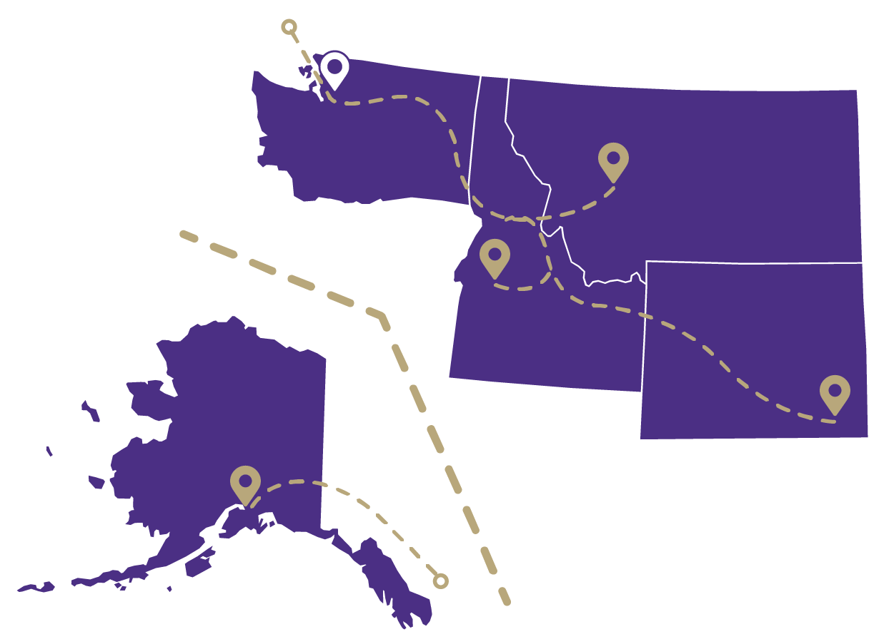
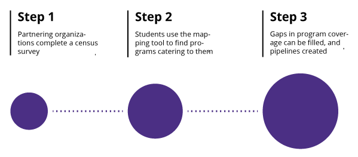
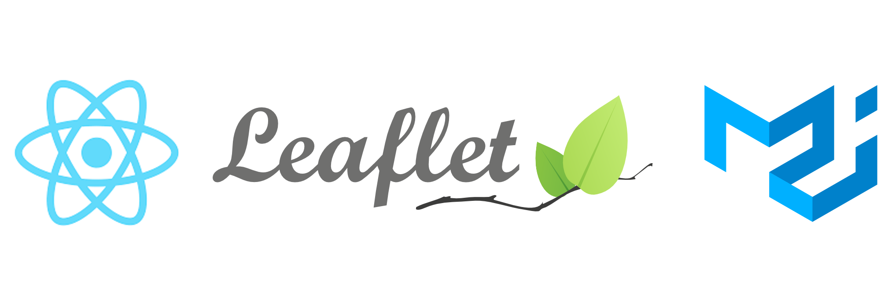

The culmination of the Informatics program at the University of Washington is a two-quarter capstone project. Students form teams of up to four and either create an original idea or partner with a sponsoring organization to complete a project. Together with my friends Andrew, Govind and Jon, we created this project.

## Waypoint
*Thousands of students in need. Five states with shortages of primary care physicians. One medical school trying to turn the tide. As part of UW Medicine, Waypoint maps the healthcare education pipeline so that programs can coordinate their outreach, and students can find the services they need to succeed as healthcare professionals.*

### Background
Since the 1970’s health professionals have known of a lack of primary care physicians in the Greater Pacific Northwest region. As the only accredited medical school in the area, the task fell on the UW School of Medicine to solve this problem.


*The five states of the WWAMI Region*

Over the next decades the School of Medicine would create the WWAMI initiative, an innovative approach to promoting health care careers in underserved areas with targeted youth outreach and medical residencies. Despite these efforts, there remained a problem: No one knew where this outreach was working and what areas still needed help. Students were falling off the map, programs were unable to collaborate, and the initiative was suffering as a whole.

### Enter Waypoint
Waypoint offers students and partnering organizations a simple information hub for finding and connecting with outreach programs. No longer do students risk the chance of not continuing their involvement, and no longer do organizations have to jump through hurdles just to connect and collaborate with similar offerings in their area of operation.

### Process as a Product
The data that fuels Waypoint was created practically from scratch. We designed a method of data collection for the WWAMI Initiative that enables them to collect clean, extensive information for an ever growing number of outreach programs. As more organizations provide this information, Waypoint will provide a greater wealth of information.


*Creating a robust API for accessing the data collected allows future teams to utilize its potential to the fullest*

Waypoint was built on the premise that good tools rely on good data. Knowing that organizational needs change, we made the database that houses all of the information we've gathered available as its own tool. Through our partner Seattle Data for Good, all of the details of this project and instructions for using the data derived from it will be made available to an entire community of innovators who will continue to help the WWAMI Initiative achieve its goal of eliminating the shortage of physicians in areas of need.

## My Part
Well that sounds cool and all, but you might be thinking "What exactly did you do, Nathan?" My role on the team for this project was Designer and Frontend Dev, so in a way, what you see is what I did: graphics (all but one), logos, layout, interaction, ooh and a fancy poster to top it off. Granted, there is more to design and frontend development than just making things look pretty. It's also a matter of knowing the data, working with it, and presenting it in a way that is actually useful to the target audience. 

### Tech I Used
As this project was sponsored by non-profits, working with open source technologies was crucial. To such end, I leveraged the following libraries to implement the functionality of the web app.
- Material UI: Why mess with success? Sure made the forms a lot easier to implement.
- Leaflet: When Google Maps API requires a credit card on file, you look elsewhere.
- React: Component architecture is life, AMIRIGHT?


*The frontend tech stack*

Oh yeah, and I made the layout with CSS Grid!

### The Development Process
This project proved to be quite fickle. Half the battle was learning what was required; the other half was showing what was possible. We ran into issues of inconsistent data, missing data, underdeveloped requirements, and general project ambiguity. As a result, a lot of the development of the actual artifact was pushed back much longer than most other capstone teams. I setup what I could in terms of site structure, navigation, general look and feel as well as some of the React components, but we were left feeling behind in terms of what we could physically show for. 

Without even remotely complete data to start with&mdash;a simple python analysis I did on the data showed that out of 8,651 data points, there were 6,758 missing entries&mdash;starting in on the mapping and filtering aspects of the app proved difficult. To remedy this, I created my own data. Armed with this dummy data, I set about to dynamically putting points on a map and putting that map on a webpage.

My initial dive down the rabbit hole was with the Google Maps API. Having worked with it previously, I figured it was as good a place as any to start. I didn't get too far in before Google overhauled the whole maps API. After this overhaul, my API key required having billing information on file. Without much of a budget, outside of the cost of rackspace in the UW Data Center, I retreated into the realm of free open source tech.

I decided to visit an old friend: Leaflet. Being one of the first JavaScript libraries I ever worked with, it felt like coming home: except home had been completely remodeled. That's the way it is with web technologies though. If you leave something for a while, it will keep moving forward and developing without you. Part of being a solid web developer is learning how to quickly adapt to changes and pick new technologies up in a snap&mdash;don't worry, not of the Thanos variety.

Once I had the map working locally with most of the functionality I wanted&mdash;more on that in a bit&mdash;we put the fake data on the database and hooked up an endpoint that I could retrieve all the data from. Eventually, the real data would live here and no change would be needed on my end. With this behind me, I left the map where it was as an MVP and moved on to the browse and filter requirement.

Since I took the time in the beginning to create reusable components, this part was a breeze. I extended one component slightly and that was about all it took. I think that's what really sold me on React in the first place: being able to write reusable, extensible html code. Sure, there are plenty other tools that can be used to achieve this, but I started with React, and kinda just kept going with it. The point is, it's never a bad idea to work smarter and not harder.

I got to the point where I was just waiting for the api endpoint to be all set, so I started checking off the list of "would be nice to have" features that we determined in the beginning. One of the biggest ones, and more of something I wanted, was a UX interaction straight out of the Google Maps playbook: click a marker, program card on the side highlights, and vice versa. Seemed easy enough right? Wrong! Going from marker to card was easy, but the other way...oh man. While working with libraries is ultimately really helpful, it does mean you have to work within the confines of the library. The Leaflet library did not provide the functionality I wanted, and instead of writing an expanded version myself, I decided to cheese it. The solution I came up with, given the time constraints I had, was something that can only be described as one thing: hacky. 

``` jsx
createMarkerIcon(program) {
  var curIcon = new L.Icon({
    iconUrl: require('../marker.svg'),
    iconSize: new L.Point(30, 60),
    className: 'icon' + program.OrgID});
  return curIcon;
}

  handleClick(orgID) {
  this.setState({ activeID: orgID});
  var card = document.getElementById(orgID);
  var iconSelected = document.getElementsByClassName(
    'icon' + orgID);
  iconSelected[0].click();
  card.scrollIntoView({
    behavior: 'smooth' 
  });
}
```

Don't burn me at the stake for this, but I added a class name to each map marker. Yes, I could have added a id attribute to the marker object, which would have been cleaner style-wise, but class name was already there and I had no time left, so I rolled with it. Then it was just a matter of enlisting the help of the trusty `document.getElementsByClassName`. This allowed me to find the marker related to the program card that was clicked in the sidebar. Now for the really hacky part... I triggered the `.click()` event on the marker, basically simulating a user clicking on the marker when they really clicked on the program card&mdash;YIKES. BUT! It worked, and it worked surprisingly well.

After that, the pieces kinda just kept falling into place. Next thing I knew, Capstone was over, the project was deployed and passed on, and I was walking across a stage in a funky looking hat.

### Lessons Learned
Web development isn't always the glamorous act of sitting in a cafe, sipping on some fancy single origin roast while spewing out code into a dark-mode text editor&mdash;okay yeah, that was me when I was actually writing the code; what can I say? I like coffee. Web development that truly matters&mdash;that provides solutions to real problems for real people&mdash;is messy. It's sitting in meetings, countless email threads, pursuing options that ultimately fail, and a whole lot of feeling behind and never ahead. But if you stick with it and push when you want to quit, it is also the small triumphs of overcoming roadblocks, the joys of seeing it through to the end, and the satisfaction of achieving something that actually helps people.

It's only now, looking back that I realize the significance of what we did is so much more than the MVP of a web app that we gave our sponsors. By starting with them from the beginning, helping them develop a new survey that would yield complete and accurate entries, assisting them with the setup of a server and domain, and showing them what is ultimately possible, we laid the solid foundation of a project that can be developed for years to come into the resource envisioned.


*Illuminating the path between the dreams of today and the healthcare of tomorrow*

Created by: Nathan Foster, Andrew Kan, Govind Pillai and Jon Shilling

Sponsored by: UW Medicine, WWAMI, Western Washington AHEC, and Seattle Data for Good

*Special thanks to Leonora B Clarke (UWSOM), Benjamin Xie (UW iSchool), and Jeremy Caci (UW Undergraduate Affairs)*