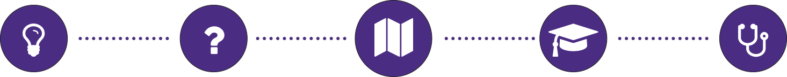

The culmination of the Informatics program at the University of Washigton is a two-quarter capstone project. Students form teams of up to four and either create an original idea or partner with a sponsoring organization to complete a project. 

## Waypoint

*Thousands of students in need. Five states with shortages of primary care physicians. One medical school trying to turn the tide. As part of UW Medicine, Waypoint maps the healthcare education pipeline so that programs can coordinate their outreach, and students can find the services they need to succeed as healthcare professionals.*

### Background

Since the 1970’s health professionals have known of a lack of primary care physicians in the Greater Pacific Northwest region. As the only accredited medical school in the area, the task fell on the UW School of Medicine to solve this problem.

*The five states of the WWAMI Region*

Over the next decades the School of Medicine would create the **WWAMI initiative**, an innovative approach to promoting health care careers in underserved areas with targeted youth outreach and medical residencies. Despite these efforts, there remained a problem: No one knew where this outreach was working and what areas still needed help. Students were falling off the map, programs were unable to collaborate, and the initiative was suffering as a whole.

### Enter Waypoint

Waypoint offers students and partnering organizations a simple information hub for finding and connecting with outreach programs. No longer do students risk the chance of not continuing their involment, and no longer do organizations have to jump through hurdles just to connect and collaborate with similar offerings in their area of operation.

### Process as a Product

The data that fuels Waypoint was created practically from scratch. We designed a method of data collection for the WWAMI Inititiave that enables them to collect clean, extensive information for an ever growing number of outreach programs. As more organizations provide this information, Waypoint will provide a greater wealth of information.

*Creating a robust API for accessing the data collected allows future teams to utilize its potential to the fullest*

Waypoint was built on the premise that good tools rely on good data. Knowing that organizational needs change, we made the database that houses all of the information we've gathered available as its own tool. Through our partner Seattle Data for Good, all of the details of this project and instructions for using the data derived from it will be made available to an entire community of innovators who will continue to help the WWAMI Initiative acheive its goal of eliminating the shortage of physicians in areas of need.

*Illuminating the path between the dreams of today and the healthcare of tommorow*

Created by: Nathan Foster, Andrew Kan, Govind Pillai and Jon Shilling

Sponsored by: UW Medicine, WWAMI, Western Washington AHEC, and Seattle Data for Good

*Special thanks to Leonora B Clarke (UWSOM), Benjamin Xie (UW iSchool), and Jeremy Caci (UW Undergraduate Affairs)*