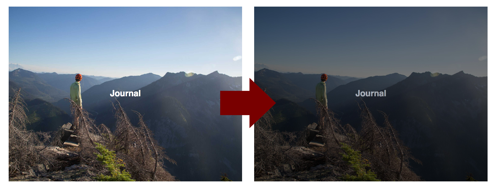

Part of being a web developer, slash photographer, slash self-proclaimed adventurer in the times of the interwebs is having and maintaining a personal website. I decided to take it a step further, and document the process that led me to the creation of my very own. This is that story.

## The OG, V0
My very first website! Not the first website I had ever built, but the first one that was all about me. Built as a project for my front-end web development class, the goal was to apply the technologies we had learned and build a personal portfolio site that we could host on GitHub Pages. 


*The header of version 0*

For this first iteration of my online presence, I paired React with the Material UI package. For simple setup, I used Create React App, an awesome CLI that takes the configuration out of building a React app. It was pretty simplistic, only showcasing a few of my other projects from the class, but it was my first portfolio site. I was pretty proud of it, so I kept it...longer than I should have.

## V1: Time for a change
When your bio on your site says you are a junior, but you are now a senior, it's probably time for some updates. Now I could have just updated the bio, added some more projects, and called it good, but that's no fun. What is fun, is creating a new repo and starting from scratch. It's also the perfect opportunity to learn something new.

Having already tackled flexbox, I decided to check out the capabilities of CSS grid. Where flexbox is great at aligning the horizontal, grid aims at tackling the vertical space as well to create full layouts. The main setup of a grid-based layout is quite straightforward. Under the CSS rules for the parent div, classed here as *container*, set `display: grid`. Then define the grid columns and rows.

```css
.container {
  display: grid;
  grid-template-columns: repeat(2, 1fr);
  grid-template-rows: 100vh repeat(4, 250px);
  width: 100%;
}
```

Here I am using the `repeat()` function to keep the lines concise. I am also using the nifty `fr` unit, which can dynamically split up whatever space is provided to the grid. For a great introduction to both `repeat()` and `fr`, check out the article [here](https://css-tricks.com/introduction-fr-css-unit/). Once the container is set up, it is a simple matter of telling each `<div>` where to go in the layout.

```css
.about {
  grid-column: 1 / 3;
  grid-row: 2;
}

.photography {
  grid-column: 1 / 3;
  grid-row: 3;
}
```

And boom, just like that, I had a layout! For testing I just used colored `divs` for testing purposes, because adding the images and text was going to be the easy part, right? Right??? FALSE! But more on that later.


*OOH! Look at the colors! No, but really, the layout worked.*


This isn't supposed to be a full tutorial on how to use grid, just a look at how I used it to create the layout for my homepage. If this has piqued your curiosity though, and you find yourself wanting to learn all the juicy details about CSS grid, I found [Grid By Example](https://gridbyexample.com/examples/) and [CSS-Tricks](https://css-tricks.com/snippets/css/complete-guide-grid/) to be awesome resources when getting started. 

## V2: Indecision
When I started v1, I had this grand idea of doing all the configuration and setup myself. To use React like I wanted to, this meant setting up webpack, the development server, build scripts, and that whole jazz. Not that I lost interest in doing that, but free time was in short supply as a senior in college. What free time I did have, I spent climbing and hiking, so working on my website became what I did when I wanted to procrastinate on my actual schoolwork.

In interest of removing the procrastination temptation, I decided to switch to using Create React App which would do the configuration for me, allowing me to focus on the code and get my website refresh out of dev. I quickly ported the old homepage layout into a react component, and set off on implementing the individual components that would build up the site.


*There was an idea...*

I started this whole project with this vision of the homepage and initial navigation being completely image based. Being a photographer, I figured showcasing my work from the very root of the site was the way to go. Seemed easy enough as well: have an `<a>` tag fill the assigned grid space, set its background as an image, a sprinkle of CSS and should be good to go.

``` jsx
<div key={props.text} className='imageBlock' style={style}>
  <a href={props.url}>
      <h3 className='test'>{props.text}</h3>
  </a>
</div>
```

Mmmm, false, not that straightforward. No matter which route I attempted, there was always some functionality that did not behave like I wanted it to: link hover only worked on the text, the image didn't scale properly, changing the opacity on hover hid the image&mdash;you get the drift. I don't even want to think about how many iterations it took to implement the exact functionality I wanted. At the end of the day, it did teach me a great deal on how to debug complicated CSS, so that is a plus. Unfortunately, by the time I finally got it working, it was crunch time on my [capstone project](/projects/informatics-capstone) for Informatics, and the website was put on the back burner...once again, for longer than I should have.

## Do I even mention V3?
Okay, yeah, I guess I should as V3 was a big change of pace for this project. One aspect I kept dreading was how to write journal and project posts without having a bunch of boilerplate files cluttering my repository. Plus don't get me wrong, I love writing html, but when you just want to write, it's far from ideal. The obvious and most simple choice would have been WordPress, but when you are trying to flex your technical skills for your own personal website, that just wouldn't do. Enter Gatsby.js: a static site generator that compiles markdown into html! Oh WHAT? Sign me up! 

Switching to Gatsby was super easy. Since everything was already written in React, all I had to do was install Gatsby, initialize a new project, and copy over the files. Everything worked, just as it had, even the blasted image cards on the homepage that I spent so much time with. Of course, if you've noticed the pattern between versions, you probably can already guess what comes next...

TO THE BACK BURNER ONCE AGAIN!

## And now, Number 4, the larch... uh I mean finished product!
This time, the website didn't simmer as long, but just long enough for v2 of Gatsby to be released. The cool part of working with something as new as Gatsby, is you get to experience its development in pretty much real time. Wait, was that the cool part, or the annoying part? NOPE! Definitely the cool part! So cool, that I decided to pretty much start the codebase from scratch. The only thing I kept was the grid layout CSS rules.

You mean that image card I took so long on? Yep. Scrapped that too. Why? Well, gatsby-image of course! Gatsby-image is a custom component for Gatsby that leverages GraphQL to create that tasty blur-up image loading that is all the rage.

```javascript
export const aboutQuery = graphql`
  query {
    image: file(relativePath: { eq: "ski_2019.jpg" }) {
      ...fluidImage
    }
  }
`
```

You first load in the image you want to use with a GraphQL query. I'm utilizing a query fragment called *fluidImage* to keep the queries more concise, as there are a lot of image queries in my code...no idea how that happened. Then you pass the image to the parent component using props, and render it using the Img component from gatsby-image.


```jsx

```

Switching to gatsby-image gave my site huge performance boosts&mdash;something about large images being slow. Switching still meant I had to create a new implementation of those pesky image cards for the homepage. Luckily, this I time I endeavoured to learn styled components, which is an awesome library that takes the messiness out of writing CSS. With styled components in my toolbox, re-implementing the image cards was a breeze, and the rest just fell into place.

And that was that. Over a year in the making, but this is finally done&mdash;well at least for an MVP that is. I've learned a ton while working on this project and am excited to continue working on it.

*Bonus points if you got the reference*

## The Future
Something of this nature isn't really something you can ever say is done. The list that follows contains some of the additions and improvements I want to make on this site. It is mostly for my own edification, but in case you want to know what I am planning next, here it is.

#### Additions & Improvements
- Finish the damn photo section (sheesh)
- WRITE MORE POSTS
- Them fancy previews for when I share a post
- Child route maintains active parent route in header 
- Add GitHub, Insta, and contact links in the footer
- Add comments
- ~~Post read time~~
- Share links
- Like post? (gotta get that dopamine fix)
- Grid layout for journal and project posts on larger screens?
- Switch form GitHub Pages to a more feature-rich hosting service
- SEO, SEO, SEO
- Did I say SEO?

## And the Past
If you want to see where this project has been in terms of just the code, you can check out my [Github Repo](https://github.com/natejfoster/website). I wasn't always the best at committing changes, but I have kept the states of each version as I left them before moving on to the next one.